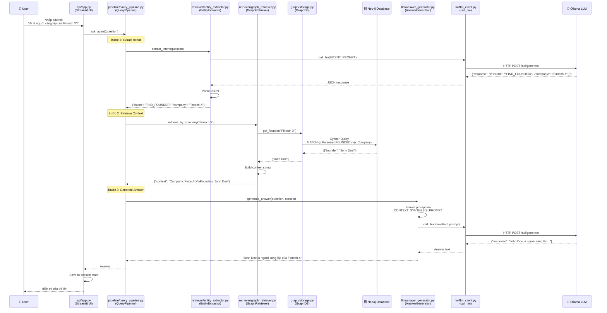
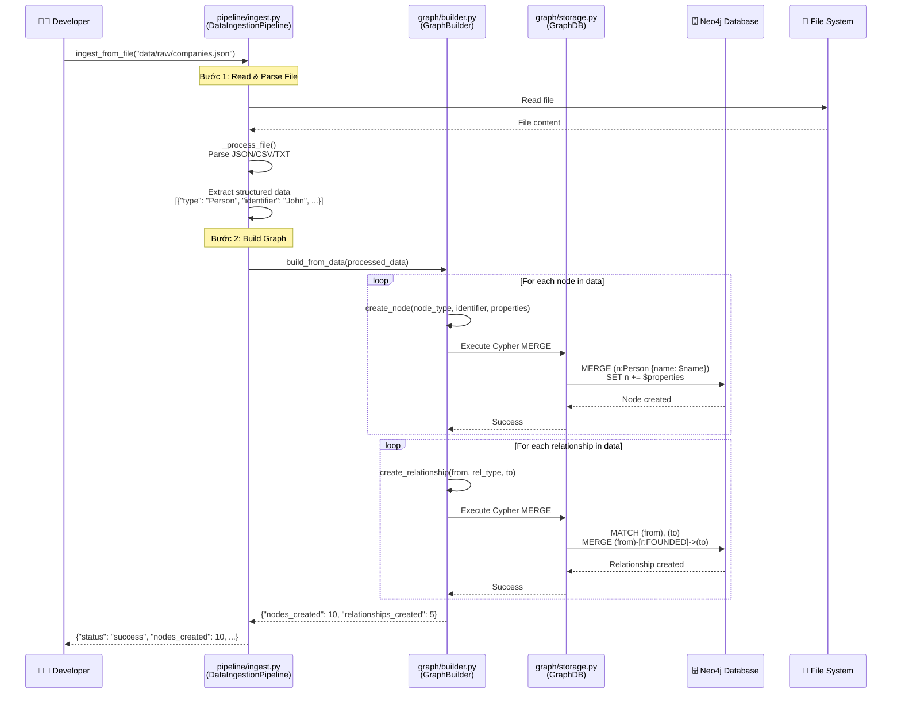
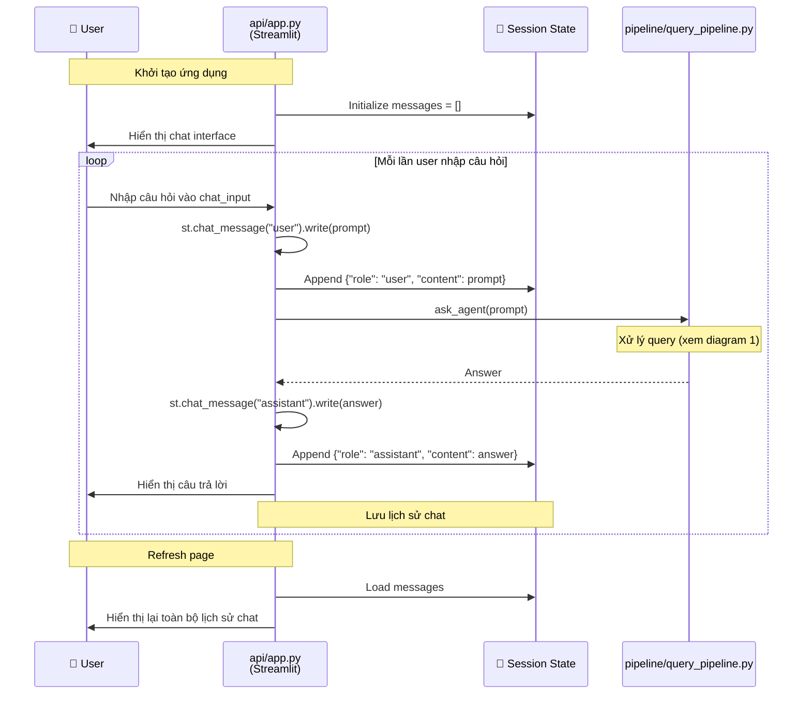
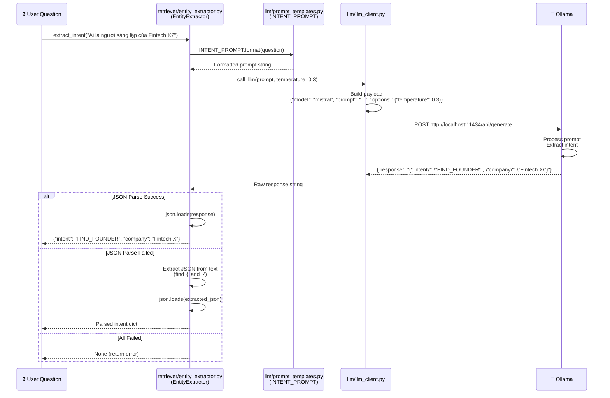
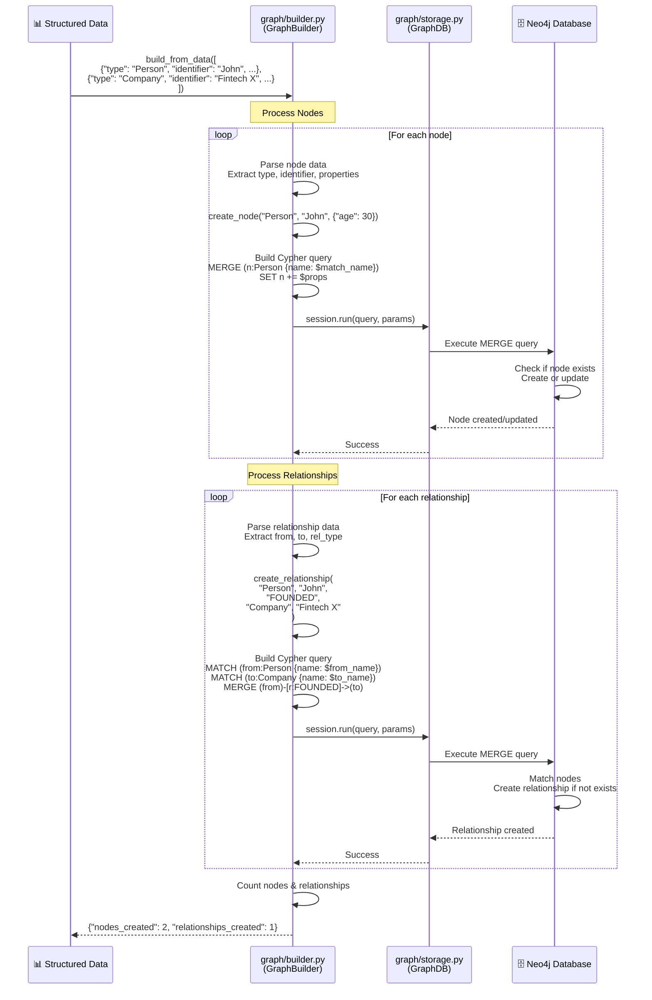
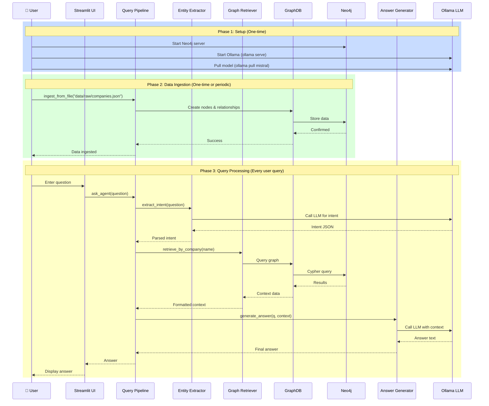
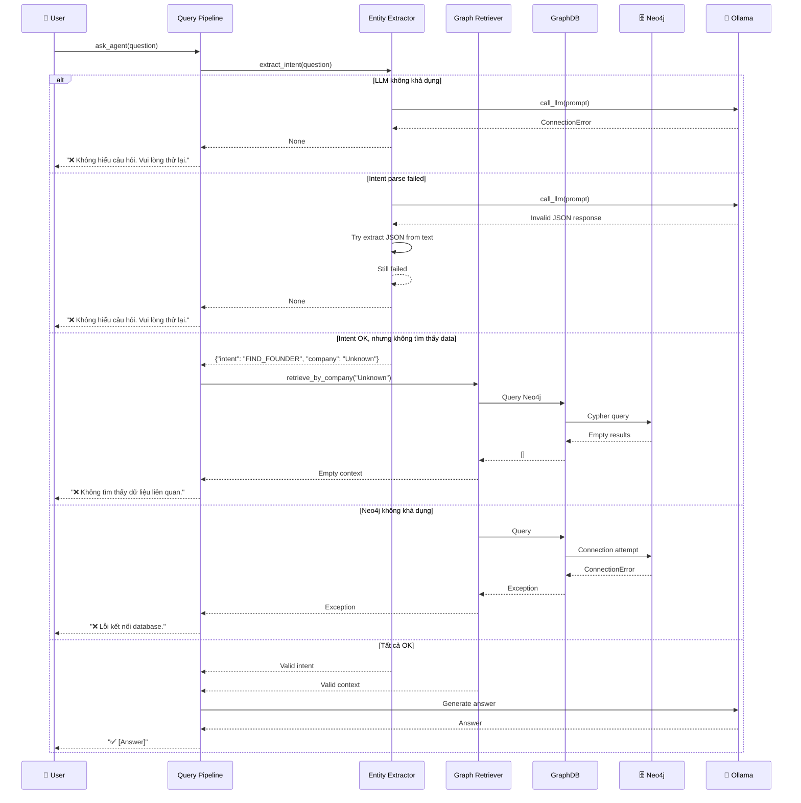
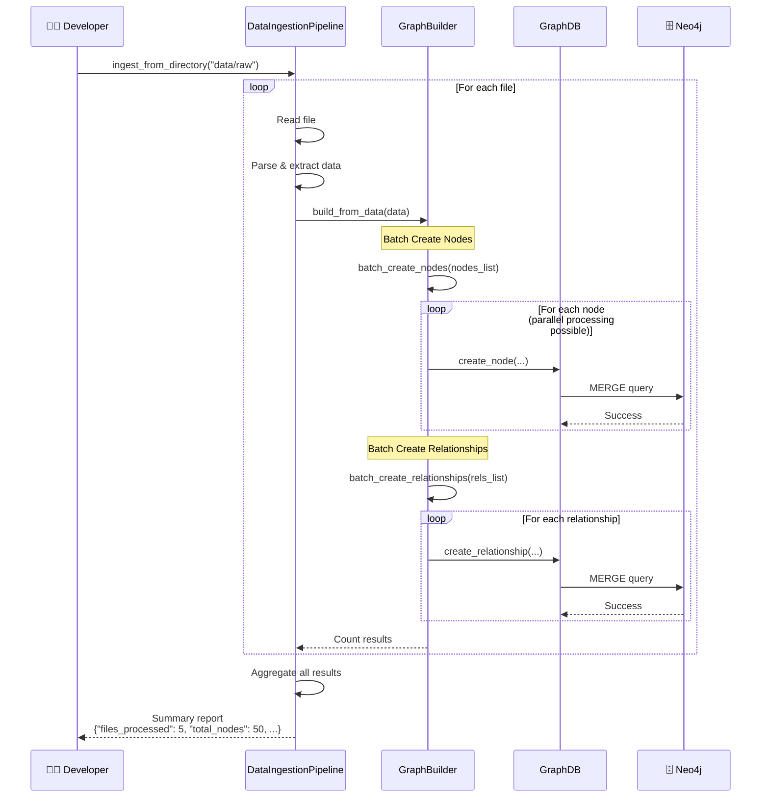

# 🔄 Sequence Diagrams - Graph RAG System

Tài liệu này mô tả các luồng hoạt động của hệ thống thông qua sequence diagrams.

---

## 📊 1. Query Processing Flow - Xử Lý Câu Hỏi

Luồng xử lý khi người dùng đặt câu hỏi:

**Mô tả các bước:**

1. **User Input**: Người dùng nhập câu hỏi vào Streamlit UI
2. **Intent Extraction**: EntityExtractor sử dụng LLM để parse câu hỏi thành structured intent
3. **Graph Retrieval**: GraphRetriever query Neo4j để lấy thông tin liên quan
4. **Answer Generation**: AnswerGenerator format prompt và gọi LLM để tạo câu trả lời
5. **Display**: UI hiển thị kết quả cho người dùng

---

## 📥 2. Data Ingestion Flow - Nạp Dữ Liệu Vào Graph

Luồng xử lý khi nạp dữ liệu từ file vào Neo4j:

**Mô tả các bước:**

1. **File Reading**: Đọc file từ `data/raw/`
2. **Processing**: Parse và extract structured data (nodes, relationships)
3. **Node Creation**: Tạo các nodes trong Neo4j với `create_node()`
4. **Relationship Creation**: Tạo các relationships với `create_relationship()`
5. **Return Results**: Trả về số lượng nodes và relationships đã tạo

---

## 🎨 3. UI Interaction Flow - Tương Tác Giao Diện

Luồng tương tác giữa người dùng và Streamlit UI:

**Tính năng:**

- **Chat History**: Lưu tất cả messages trong session state
- **Real-time**: Hiển thị ngay khi có câu trả lời
- **Persistent**: Giữ lịch sử trong suốt session

---

## 🔍 4. Entity Extraction Detail - Chi Tiết Trích Xuất Entity

Luồng chi tiết của quá trình trích xuất intent từ câu hỏi:

**Xử lý lỗi:**

- **JSON Parse**: Tự động extract JSON nếu LLM trả về text có JSON
- **Error Handling**: Trả về None nếu không parse được
- **Low Temperature**: Dùng temperature=0.3 để có kết quả JSON ổn định hơn

---

## 🏗️ 5. Graph Building Detail - Chi Tiết Xây Dựng Graph

Luồng chi tiết khi tạo node và relationship trong Neo4j:

**Đặc điểm:**

- **MERGE Operation**: Tự động tạo hoặc cập nhật node nếu đã tồn tại
- **Batch Processing**: Xử lý nhiều nodes/relationships cùng lúc
- **Generic**: Hoạt động với bất kỳ node/relationship type nào

---

## 🔄 6. Complete System Flow - Luồng Hệ Thống Hoàn Chỉnh

Tổng quan toàn bộ hệ thống từ đầu đến cuối:

**3 Phases chính:**

1. **Setup**: Khởi động Neo4j và Ollama (một lần)
2. **Data Ingestion**: Nạp dữ liệu vào graph (một lần hoặc định kỳ)
3. **Query Processing**: Xử lý câu hỏi người dùng (mỗi lần query)

---

## 🔀 7. Error Handling Flow - Xử Lý Lỗi

Luồng xử lý các trường hợp lỗi:

**Các trường hợp lỗi được xử lý:**

- ✅ LLM không khả dụng
- ✅ JSON parse failed
- ✅ Không tìm thấy data trong graph
- ✅ Neo4j connection error
- ✅ LLM generation error

---

## 📈 8. Batch Processing Flow - Xử Lý Hàng Loạt

Luồng xử lý khi ingest nhiều files hoặc tạo nhiều nodes cùng lúc:

**Tối ưu hóa:**

- **Batch Operations**: Xử lý nhiều items cùng lúc
- **Error Handling**: Tiếp tục với file tiếp theo nếu một file lỗi
- **Progress Tracking**: Trả về summary report

---

## 🎯 Tóm Tắt

Các sequence diagrams trên mô tả:

1. ✅ **Query Processing**: Luồng xử lý câu hỏi từ đầu đến cuối
2. ✅ **Data Ingestion**: Luồng nạp dữ liệu vào graph
3. ✅ **UI Interaction**: Tương tác với Streamlit
4. ✅ **Entity Extraction**: Chi tiết trích xuất intent
5. ✅ **Graph Building**: Chi tiết tạo nodes/relationships
6. ✅ **Complete System**: Tổng quan toàn hệ thống
7. ✅ **Error Handling**: Xử lý các trường hợp lỗi
8. ✅ **Batch Processing**: Xử lý hàng loạt

**Lưu ý:** Các diagrams này sử dụng Mermaid syntax và sẽ được render tự động trong các markdown viewers hỗ trợ (GitHub, GitLab, VS Code với extension, ...).
